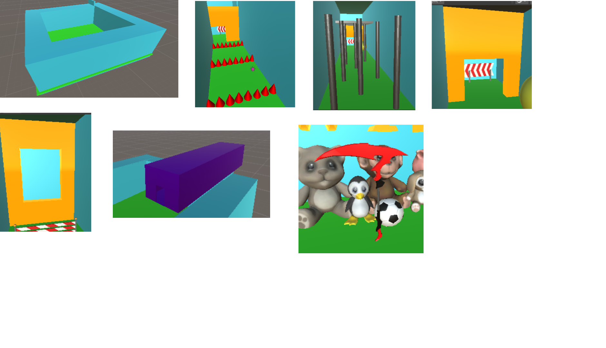
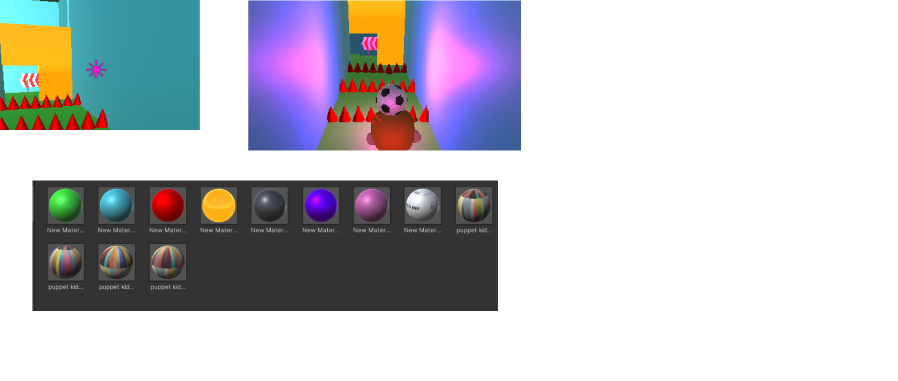

# Cena Unity 
Leonardo Macêdo e Lucas Noel
# Descrição
Essa é uma cena no Unity 3D, onde tem um labirinto com vários obstáculos que o objetivo é chegar ao final sem bater e cair.
# Cena
Utilizamos GameObjects 3D, assests da loja e objetos modelados no Blender.

## GameObjects no Blender
 Pardedes e Teto - Chão - Espinhos - Portais - Pinos - Tunelzinho - Foice.
 

## Assets da Loja
Setas - Pendûlos - Pneus - Obstáculos - Policoal - Arco - Letras (WIN) - Bichos De Pelúcia - Bandeira Final - Bola.

## Unity
Luzes - Materiais.

# Personagem
O personagem pegamos na loja de assets, adicionamos a bola em cima dele e a câmera para acompanha-lo enquanto anda.

## Script
### Movimento

Primeiro criamos uma variável para decidir a "velocidade" que o personagem andaria. Depois utilizamos o "if" para se uma tecla específica for clicada ele andaria para a frente, trás, direita e esquerda.

### Rotação

Primeiro criamos uma variável para decidir a "velocidade" que a câmera irá rotacionar. O código que faz a rotação captura o movimento do mouse horizontal e vertical, e aplica a rotação ao personagem com base na variável ´rotaçao´. A rotação ocorre no eixo horizontal (eixo X) do personagem.

